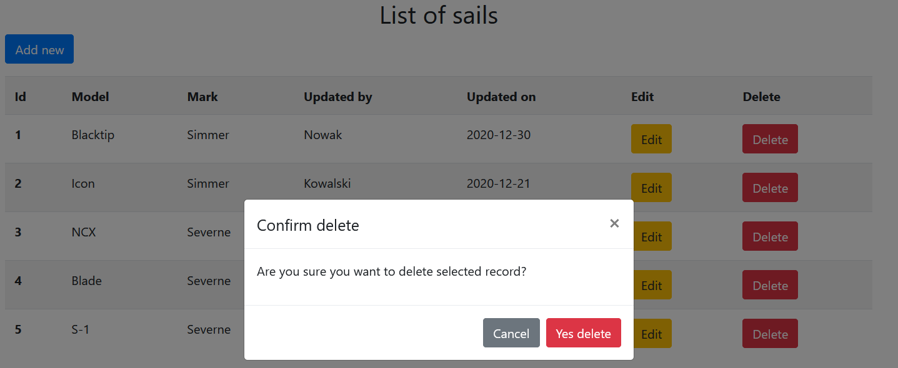

# Sail service CRUD

## General
CRUD service with "Sail" model. Used MVC software design pattern.

## Technologies
- Java 11
- Maven
- Spring Boot 2.4.0
- Thymeleaf
- Bootstrap(CSS)
- JQuery/JavaScript
- H2 DB
- JPA  

## Configuration
H2 DB application.properties:

    spring.h2.console.enabled=true

    spring.datasource.platform=h2
    spring.datasource.url=jdbc:h2:mem:dbSails
    spring.datasource.initialization-mode=always
    spring.datasource.data= classpath:/data.sql
    
    spring.jpa.hibernate.ddl-auto=update

## Screenshots

